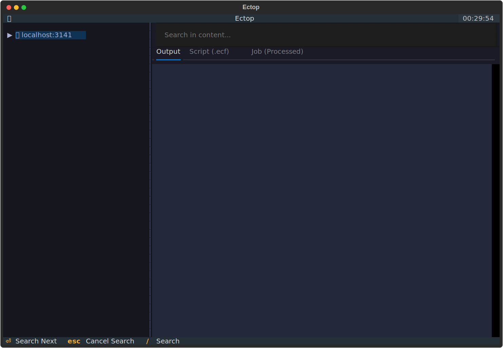

# 🚀 ectop

`ectop` is a high-performance, Textual-based Terminal User Interface (TUI) for monitoring and controlling [ecFlow](https://ecflow.readthedocs.io/en/latest/) servers. Designed for efficiency and responsiveness, it provides a modern alternative to traditional ecFlow monitoring tools.



## ✨ Features

- **📡 Real-time Monitoring**: View the status of your ecFlow suites, families, and tasks in a hierarchical tree view. The UI updates periodically to reflect the latest server state.
- **🛠️ Node Management**: Perform common ecFlow operations directly from the TUI:
    - **Suspend/Resume**: Pause or continue execution of nodes.
    - **Kill**: Terminate running tasks.
    - **Force Complete**: Manually set a node to the complete state.
    - **Requeue**: Reset a node for execution.
- **🔍 File Inspection**: Quickly view logs, scripts, and generated job files:
    - **Log Output**: Live view of task logs with optional auto-refresh.
    - **Scripts**: View the original ecFlow script.
    - **Jobs**: Inspect the generated job file.
- **⚡ Search**: Interactive live search to find nodes in large suites, optimized with lazy loading.
- **⌨️ Command Palette**: Searchable command interface for quick access to all application actions.
- **❓ Why?**: A dedicated "Why" inspector to understand why a node is in its current state (e.g., waiting for triggers or limits).
- **📝 Variable Management**: View and modify node variables (Edit and Add) on the fly.
- **✍️ Interactive Script Editing**: Edit scripts using your preferred local editor (via `$EDITOR`) and update them on the ecFlow server instantly.

## ⏱️ Quick Start

Get up and running with a demo suite in seconds:

1.  **Start a local ecFlow server**:
    ```bash
    ecflow_server --port 3141
    ```
2.  **Initialize the demo environment**:
    ```bash
    python examples/ectop_demo.py --load
    ```
3.  **Launch ectop**:
    ```bash
    ectop --port 3141
    ```

## 📦 Installation

### Using Conda (Recommended)

Since `ecflow` is primarily distributed via Conda, this is the easiest way to get started:

```bash
conda env create -f environment.yml
conda activate ectop
```

### Using Pip

If you already have `ecflow` installed on your system:

```bash
pip install .
```

## 📚 Documentation

- [**Tutorial**](tutorial.md) - A step-by-step guide to mastering `ectop`.
- [**Options & Configuration**](options.md) - Full list of CLI arguments and key bindings.
- [**Architecture**](architecture.md) - Deep dive into how `ectop` works.
- [**Reference**](reference.md) - API documentation.
- [**Contributing**](contributing.md) - How to help improve `ectop`.
