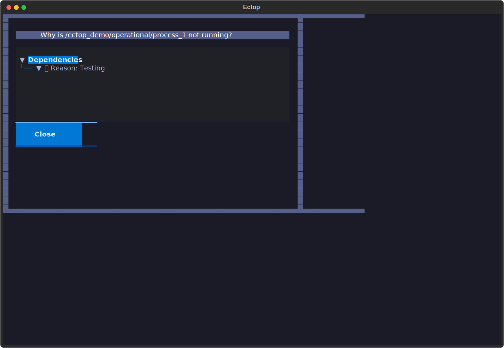
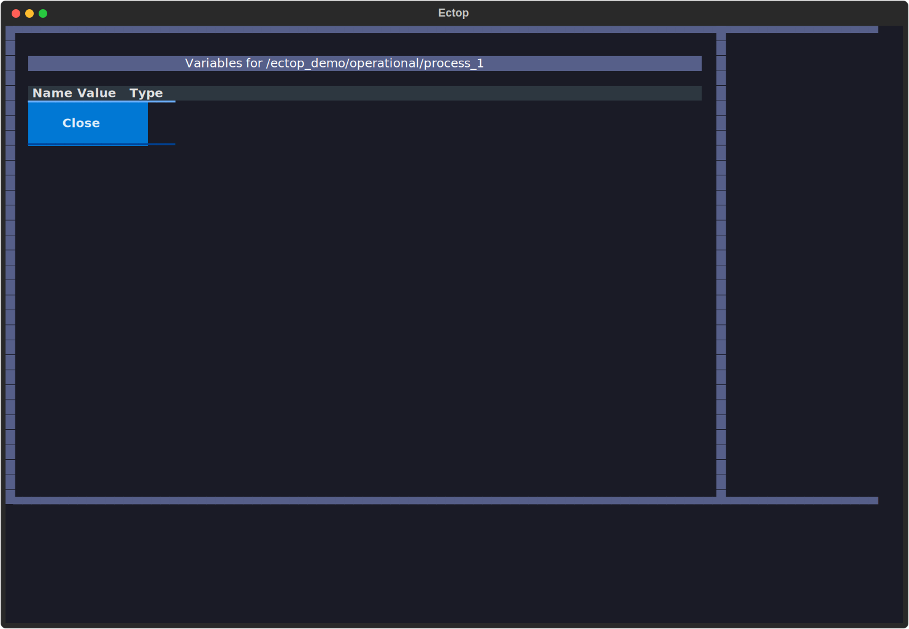

# #############################################################################
# WARNING: If you modify features, API, or usage, you MUST update the
# documentation immediately.
# #############################################################################

# Tutorial: Mastering ectop

This tutorial will guide you through using `ectop` to monitor and manage a realistic ecFlow suite.

## Prerequisites

1.  **ecFlow Server**: Ensure you have an ecFlow server running.
    ```bash
    ecflow_server --port 3141 &
    ```
2.  **ectop**: Installed and ready to use.

## Step 1: Initialize the Demo Environment

We provide a comprehensive demo script in `examples/ectop_demo.py` that sets up a suite with various features (limits, triggers, and expected failures).

1.  **Load the demo suite**:
    ```bash
    python examples/ectop_demo.py --port 3141 --load
    ```
    This script will:
    - Create a suite named `ectop_demo`.
    - Generate all necessary task scripts in `./ectop_demo_home`.
    - Load the definition into your local server and begin playback.

## Step 2: Launch ectop

Start `ectop` to monitor the demo suite:

```bash
ectop --port 3141
```

You should see the `ectop_demo` suite in the tree on the left.


---

## 🛠️ Core Interactions

### 🌳 Navigating the Tree
- Use **Arrow Keys** to move up and down.
- Press **Enter** to expand or collapse families and suites.
- Icons indicate node status:
    - 🔵 **Queued**: Waiting for its turn.
    - 🔥 **Active**: Currently running.
    - 🟢 **Complete**: Finished successfully.
    - 🔴 **Aborted**: Failed.
    - 🟠 **Suspended**: Paused by a user.

### 📄 Viewing Node Content
Select a task (e.g., `ectop_demo/operational/batch/process_1`) and press `l` to **Load**.
- **Output Tab**: View the live log output.
- **Script Tab**: See the `.ecf` source script.
- **Job Tab**: Inspect the generated job file sent to the scheduler.

### ⚡ Node Operations
Manage your workflow with simple keypresses:
- **Suspend (`s`) / Resume (`u`)**: Pause or unpause nodes.
- **Kill (`k`)**: Terminate an active task.
- **Force Complete (`f`)**: Manually mark a task as successful.
- **Requeue (`Shift + R`)**: Reset a node and its children to the Queued state.

---

## 🔍 Advanced Features

### ❓ Why is it Queued?
If a task is stuck in the `Queued` state, select it and press `w` to open the **Why Inspector**. It will show you exactly what is blocking the node, such as:
- Unmet trigger expressions (e.g., `task_a == complete`).
- Resource limits (e.g., `max_jobs` limit reached).
- Time dependencies.



### 🕵️ Searching the Suite
In large deployments, finding a node can be difficult.
1. Press `/` to open the **Search Box**.
2. Type part of the node name or path.
3. The tree will filter in real-time. Press **Enter** to select the match and clear the search.

### 🎭 Filtering by Status
Focus on what matters by filtering the tree.
- **Cycle Filter (`Shift + F`)**: Cycle through status filters like `Aborted`, `Active`, or `Suspended`.
- **Focus Mode (`Shift + H`)**: A quick toggle to hide all `complete` nodes from the tree, allowing you to focus on work that is still in progress.

### 🧟 Zombie Management
Orphaned tasks (zombies) can sometimes clog your scheduler. Press `Shift + Z` to open the **Zombie Dashboard**.
- View all zombies across the server with their process IDs and creation times.
- Select a zombie and use `f` to **Fob**, `F` to **Fail**, or `a` to **Adopt** it.

### 📊 Performance Timeline
To identify bottlenecks in your workflow, check the **Timeline** tab in the main content area (available after pressing `l` on a family or task).
- Visualizes the relative state-change times of sibling tasks.
- Helps identify which tasks in a family are taking the longest to start or finish.

### 📝 Managing Variables
Select any node and press `v` to open the **Variable Tweaker**.
- View **User**, **Generated**, and **Inherited** variables.
- Press **Edit** to modify an existing variable.
- Press **Add** to create a new variable (useful for overriding inherited values).



### ✍️ On-the-fly Script Editing
Need to fix a bug in a script?
1. Select the task and press `e`.
2. Your local `$EDITOR` opens with the script content.
3. Save and quit your editor.
4. `ectop` will prompt to update the script on the server and optionally **Requeue** the task to apply the fix immediately.

---

## 🎮 Server Management

`ectop` also allows you to control the ecFlow server itself:
- **Halt Server (`Shift + H`)**: Stops the server from scheduling new tasks.
- **Start Server (`Shift + S`)**: Resumes scheduling.
- **Load New Definitions (`Shift + L`)**: Load additional `.def` files without leaving the TUI.

---

## Next Steps

- Explore the [**Architecture**](architecture.md) to understand how `ectop` maintains performance.
- Check the [**Options**](options.md) for a full list of configuration environment variables.
